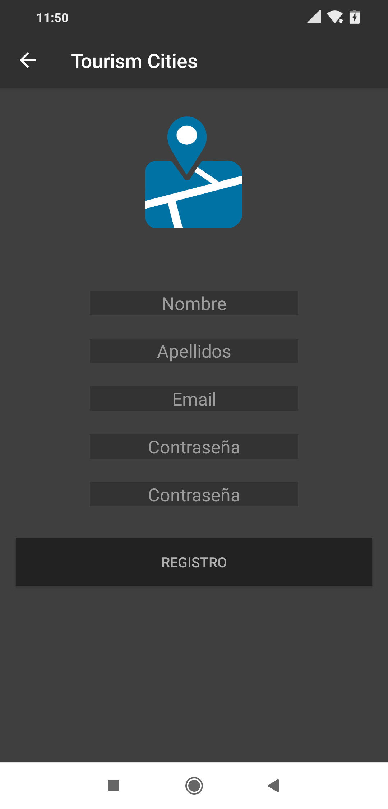
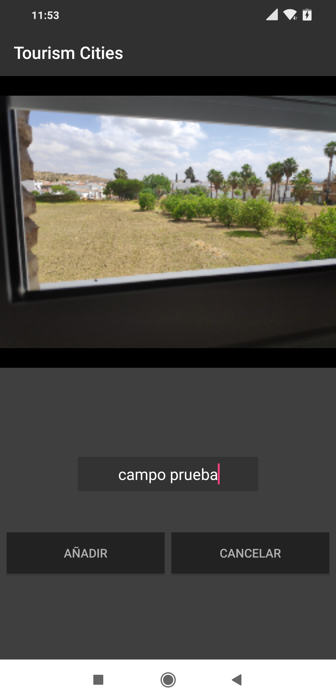
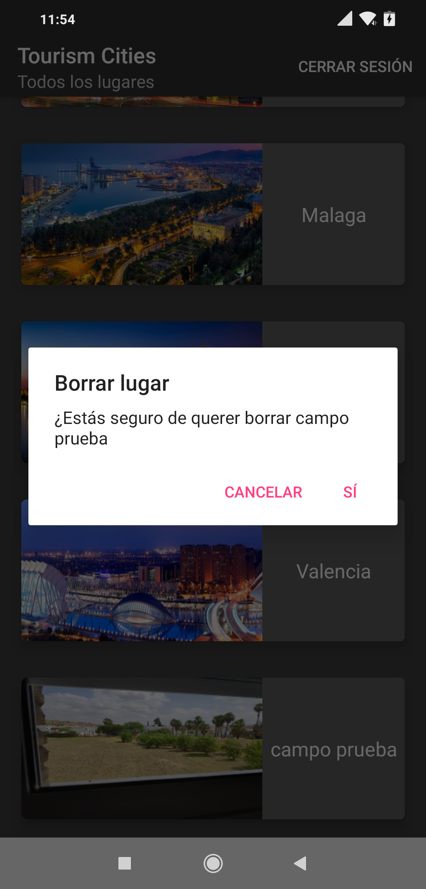

# TourismCities
El proyecto consta de dos partes en este repositorio está el código de la parte android y la parte web está en el siguiente repositorio

[BI Web](https://github.com/andresfernandeznad/TourismCitiesAppBussiness/)

La url donde está alojada esta aplicación web es 
https://tourism-cities.firebaseapp.com/

En ella podremos ver una pantalla de login para el manager

Tras logearnos tendremos a nuestra disposición unos gráficos con información del rendimiento que está teniendo nuestra aplicación

También podremos descargar la info de estos gráficos en formato excel o pdf
Si descargamos en pdf tendremos algo tal que así

Y si lo descargamos en formato excel tendremos algo tal que así

Y esta sería la parte de BI, ahora pasamos a la aplicación android como tal.

Esta es una aplicación para almacenar información de tus lugares favoritos para hacer turismo, respecto a unos lugares añadidos por el admin u otros usuarios de la aplicación

 Lo primero es una pantalla donde podemos loguearnos mediante nuestro email y contraseña o acceder a la pantalla de registro de la aplicación

Aquí si nos vamos al registro se nos abrirá esta pantalla

Donde podremos registrarnos en la aplicación para posteriormente loguearnos con nuestro usuario.
Una vez logueados la primera pantalla que veremos es la de todos los lugares disponibles en la aplicación, los cúales podrás añadir a favoritos si te han gustado
o si tendrías interés en ellos para visitarlos en un futuro.
También podemos añadir un nuevo lugar si le damos al +

Aquí podremos hacer diversas cosas, si pulsamos algún lugar este nos mandará a la pantalla de información del lugar
con su nombre, foto y ubicación en el mapa de google desde el cual dandole al marcador podremos ir
a la aplicación de google maps para verlo ahí o ver como llegar al sitio.

Volviendo al listado principal de lugares en él arriba a la derecha podremos hacer distintas cosas en el menú
que nos aparece como por ejemplo cerrar sesión, ir a nuestros lugares favoritos o a nuestro perfil

Vamos a añadir un lugar a nuestros lugares favoritos, para ello vamos a hacer una pulsación larga sobre
el lugar que queramos

Una vez nos salga el menú le damos y ya se nos añadirá a nuestros lugares favoritos, aunque el admin cambie o elimine
los lugares que proporciona la aplicación nuestros lugares favoritos se mantendrán guardados a no ser que queramos
borrarlos.

Ahora nos vamos a nuestros lugares favoritos desde el menú de opciones

Aquí podemos hacer igualmente a la info del lugar como vimos antes.
Si hacemos una pulsación larga sobre el lugar que ya no queramos guardar en favoritos pues podemos
borrarlo gracias al menú que nos aparece

Ahora vamos a volver al listado principal y podemos meternos por ejemplo en el perfil

Aquí podemos ver nuestra foto de perfil la cual podemos cambiar y nuestro nombre y apellidos los cuales también podemos cambiar.
Volvemos atrás y ahora por ejemplo vamos a añadir un nuevo lugar, para ello le damos al +
Se abrirá la cámara y hacemos la foto al lugar en cuestión y recoge la localización y tal y al darle a añadir se añade a nuestra lista de lugares.

Ahora vamos a salir de la aplicación pero antes nos saldrá un mensaje de confirmación

Cerramos sesión y volvemos al login

Ahora el admin también puede acceder y ver la lista de lugares
Y aquí el podrá borrar lugares de base de datos si no son correctos o simplemente por antiguedad

Y un mensaje de confirmación

Eso sí, si un usuario ha añadido un lugar a favoritos y el admin borra ese lugar de base de datos, ese lugar persistirá en 
favoritos.
Y podemos cerrar sesión y volvemos al login

