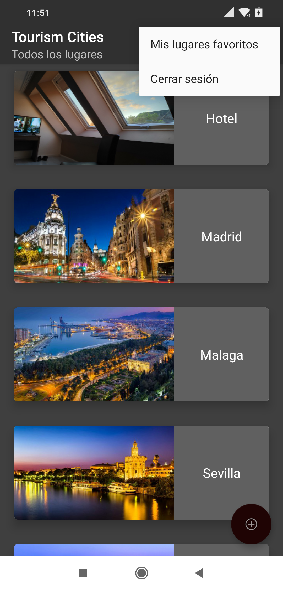
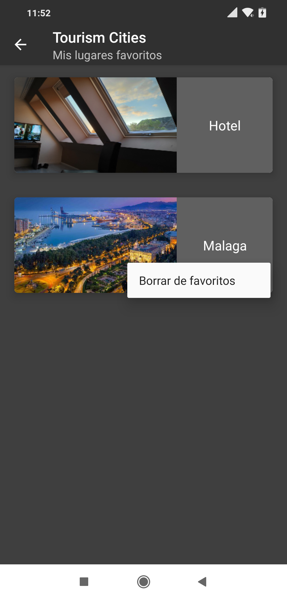

# TourismCities
Esta es una aplicación para almacenar información de tus lugares favoritos para hacer turismo, respecto a unos dados por el admin

 Lo primero es una pantalla donde podemos loguearnos mediante nuestro email y contraseña o acceder a la pantalla de registro de la aplicación

Aquí si nos vamos al registro se nos abrirá esta pantalla

Donde podremos registrarnos en la aplicación para posteriormente loguearnos con nuestro usuario.
Una vez logueados la primera pantalla que veremos es la de todos los lugares disponibles en la aplicación
son lugares o ciudades proporcionados por el admin, los cúales podrás añadir a favoritos si te han gustado
o si tendrías interés en ellos para visitarlos en un futuro.

Aquí podremos hacer diversas cosas, si pulsamos algún lugar este nos mandará a la pantalla de información del lugar
con su nombre, foto y ubicación en el mapa de google desde el cual dandole al marcador podremos ir
a la aplicación de google maps para verlo ahí o ver como llegar al sitio.

Volviendo al listado principal de lugares en él arriba a la derecha podremos hacer distintas cosas en el menú
que nos aparece como por ejemplo cerrar sesión, ir a nuestros lugares favoritos o a nuestro perfil cuya función ahora
mismo no está disponible

Vamos a añadir un lugar a nuestros lugares favoritos, para ello vamos a hacer una pulsación larga sobre
el lugar que queramos

Una vez nos salga el menú le damos y ya se nos añadirá a nuestros lugares favoritos, aunque el admin cambie
los lugares que proporciona la aplicación nuestros lugares favoritos se mantendrán guardados a no ser que queramos
borrarlos.

Ahora nos vamos a nuestros lugares favoritos desde el menú de opciones

Aquí podemos hacer igualmente a la info del lugar como vimos antes.
Si hacemos una pulsación larga sobre el lugar que ya no queramos guardar en favoritos pues podemos
borrarlo gracias al menú que nos aparece

Ahora vamos a volver al listado principal y como última función si le damos en el menú de opciones a
Cerrar sesión nuestra sesión se cerrará y volveremos a la pantalla inicial de login

